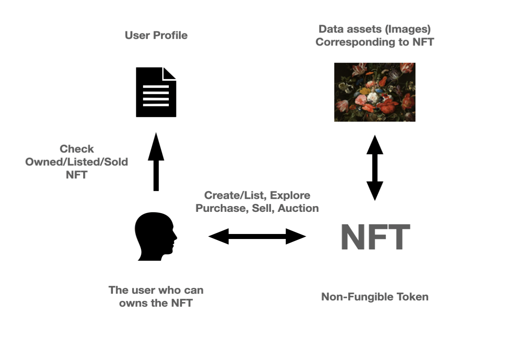
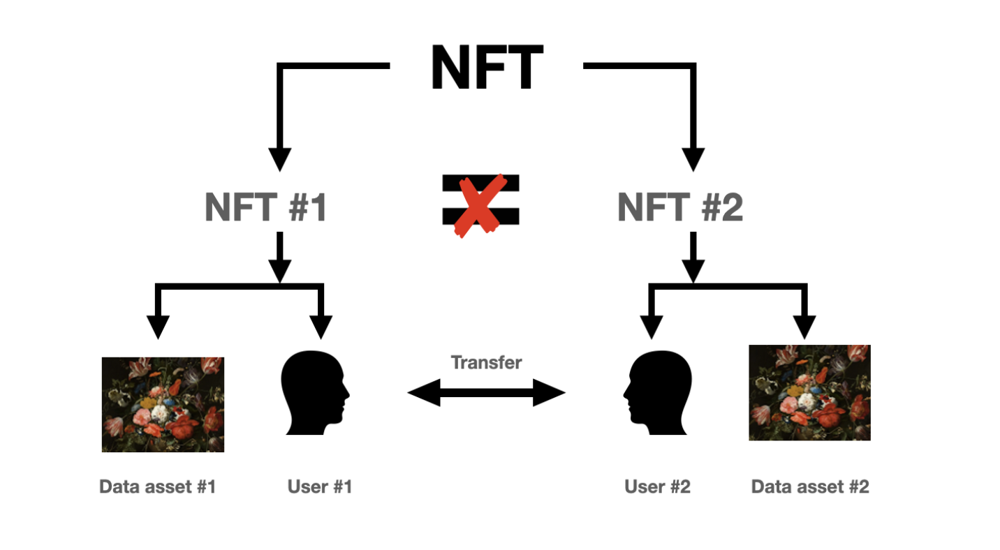

# EECE571G Group 9 NFT Market

Authored by Zuhao Chen, Yuan Gao, Menghong Huang, Qingyuan Li, Jingwen Zhou

## Brief Introducion 
- Digital artists face a number of problems in their work and efforts as the world becomes increasingly digital. They frequently discover that their art- work has been reproduced without their permission and is being utilised to generate royalties. 
- The emergence of non-fungible tokens (NFTs) substan- tially resolves this issue since blockchains enable anybody to observe the whole transfer history of a specific NFT at any time. In this case, we can observe who produced the NFT as well as who purchased it, who kept it for how long, and at what value the transaction took place. When it comes to ownership, this makes things quite obvious. 
- The goal of this project was to develop a decentralised application (DApp) for the NFT marketplace. The NFT can be purchased, sold, and auctioned through the use of the DApp.

### Simple Structure of the DApp


### NFT Transfer between Users


## Requirements For Initial Setup
- Install [NodeJS](https://nodejs.org/en/), should work with any node version below 16.5.0
- Install [Hardhat](https://hardhat.org/)

## Technology & Tools
- Solidity - Smart Contract
- Javascript - React and Test
- [Ethers](https://docs.ethers.io/v5/) - Blockchain
- [Hardhat](https://hardhat.org/) - Development Framework
- [OpenZeppelin](https://openzeppelin.com/) - NFT Interface
- [Ipfs](https://ipfs.io/) - Metadata storage
- [React routers](https://v5.reactrouter.com/) - Navigational components

## Setting Up
### 1. Clone/Download the Repository
```
$ git clone https://github.com/blaze-chen/EECE571G_NFT_Market.git
```

### 2. Dependencies:
```
$ npm install
$ npm install bootstrap@5.1.3
```

### 3. Boot up local development blockchain
```
$ cd EECE571G_NFT_Market
$ npx hardhat node
```

### 4. Connect development blockchain accounts to Metamask
- Copy private key of the addresses and import to Metamask
- Connect the metamask to hardhat blockchain, network 127.0.0.1:8545.
- If you have not added hardhat to the list of networks on your metamask, open up a browser, click the fox icon, then click the top center dropdown button that lists all the available networks then click add networks. A form should pop up. For the "Network Name" field enter "Hardhat-node". For the "New RPC URL" field enter "http://127.0.0.1:8545". For the chain ID enter "31337". Then click save.  

### 5. Migrate Smart Contracts
`npx hardhat run src/scripts/deploy.js --network localhost`

### 6. Launch Frontend
`$ npm run start`

License
----
MIT


